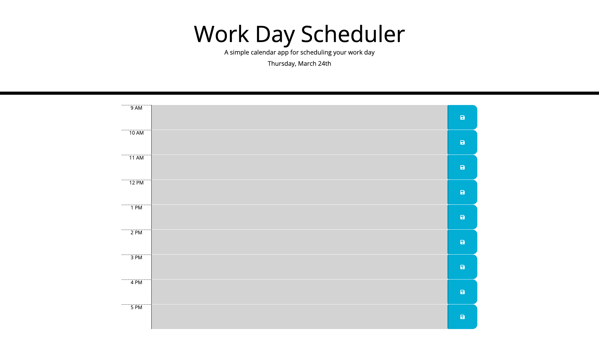

# Work Day Planner

## Description

This project was made to help organize a busy work day. It was a great experiance to work with moment js and jquery. 

## Installation

This application can be accessed through the project repository or the link provided below.  
[Work Day Planner](https://nhilde.github.io/workDayPlanner/)

## Usage

To use this app, type your goals into the time slots and hit the save button. The current hour will display as red, the 
future green, and the past as grey.

    

## License

Licensed under the [MIT License](LICENSE)